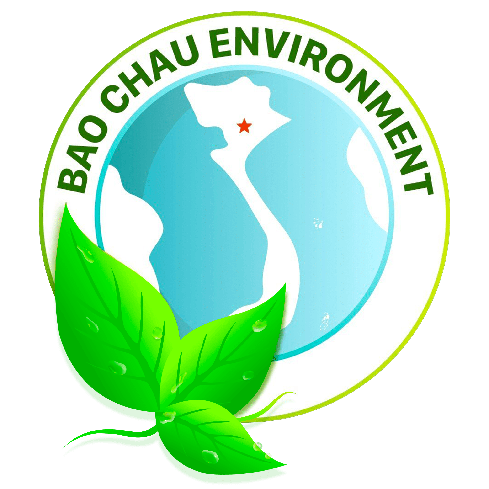

# Quy Chuẩn Phát Triển & Chuẩn Hóa Giao Diện Môi Trường Bảo Châu

## 1. NGUYÊN TẮC CỐT LÕI (MANDATORY RULE)
* **Luôn lấy cách viết code, cấu trúc markup, component, class CSS, dataset và script của trang chủ `index.html` làm chuẩn mực duy nhất (Single Source of Truth).**
* Khi tạo mới hoặc cập nhật bất kỳ trang con nào (như `about.html`, `service.html`, `project.html`, `contact.html`,...):

### 1.1. Header & Navigation
- Tái sử dụng chính xác markup masthead, navbar, dropdown menu đa cấp.
- Mobile off-canvas drawer (`#offCanvasMenu`) bắt buộc có:
  - Header drawer: Logo Bảo Châu + typography tên công ty + nút đóng (x).
  - Body drawer: Accordion menu phân cấp cuộn `flex-1 overflow-y-auto`.
  - Footer drawer: Ghim nút hotline tư vấn nhanh `Hotline: 0915 549 148`.
- Hiệu ứng kính mờ `glass-effect` và bo tròn mềm `rounded-full`.

### 1.2. Background Shapes & Trang trí
- Ngay dưới thẻ mở `<main class="main site-content" id="site-content">` luôn có 2 lớp background:
  ```html
  <div class="webhd-shap-bg">
    
  </div>
  <div class="webhd-shap">
    
  </div>
  ```

### 1.3. Section Subtitle Badge (Tiêu đề phụ / Tagline phía trên Heading)
- Mọi tiêu đề phụ của tất cả các section (như *Giới thiệu năng lực*, *Giá trị cốt lõi*, *Hành trình phát triển*, *Khách hàng tiêu biểu*, *Dự án tiêu biểu*,...) **bắt buộc phải sử dụng chung 1 cấu trúc chuẩn duy nhất từ trang chủ**:
  ```html
  <div class="inline-flex items-center gap-2 lg:gap-3 mb-3 lg:mb-4">
    <span class="icon-list-icon">
      
    </span>
    <span class="icon-list-text bg-linear-to-r from-(--text-color) to-gra-light bg-clip-text text-transparent font-bold uppercase text-xs sm:text-sm tracking-wider">
      TÊN TIÊU ĐỀ PHỤ
    </span>
  </div>
  ```
- **Tuyệt đối không tự chế các kiểu badge khác nhau** (như chấm tròn pulse, pill background đỏ/xanh, viền badge...).

### 1.4. Slider Khách hàng & Đối tác (Marquee Swiper Slider)
- Slider đối tác 2 hàng chạy vô tận (Row 1 RTL, Row 2 LTR).
- Markup chuẩn `[data-fx-slider]`, `.swiper-container`, `.swiper`, `.swiper-marquee.swiper-wrapper`.
- Card logo sử dụng: `.c-light-button.glass-effect.rounded-xl.border.border-white`.

### 1.5. Cấu trúc Card & Component Thống nhất
- Thẻ card nội dung, dịch vụ, giá trị cốt lõi, cột mốc sử dụng:
  `class="card-item relative glass-effect group focus:outline-none border border-black/8 bg-white/95 hover:bg-white rounded-3xl p-6 xl:p-8 shadow-sm hover:shadow-lg transition-all"`
- Icon wrapper cố định kích thước `52x52px` và SVG `26x26px` tránh vỡ layout.

### 1.6. Floating Contact Buttons & Back to Top
- **Floating Contact Widget** (`.add-this.contact-link`):
  - 2 nút Zalo (`.zalo`): 0915 549 148 & 0915 219 148
  - 2 nút Hotline (`.hotline`): 0915 549 148 & 0915 219 148
  - 1 nút Bản đồ (`.contact-map`): Trỏ link Google Maps
- **Nút Back to Top** (`.c-back-to-top`): Dùng SVG `<use href="#icon-angle-top-solid"></use>` kèm khối SVG `<defs>` ẩn ở cuối trang.

### 1.7. Footer 3 Cột Chuẩn Trang Chủ
- **Cột 1 (Thông tin Doanh nghiệp)**:
  - CÔNG TY TNHH DỊCH VỤ VÀ KỸ THUẬT MÔI TRƯỜNG BẢO CHÂU
  - Trụ sở: 180/40 Nguyễn Hữu Cảnh, Phường Thạnh Mỹ Tây, TP. Hồ Chí Minh
  - GPĐKKD / MST: 0317615845
  - Email: `info@baochauenvir.com` và `baochauenvir@gmail.com`
  - Mạng xã hội: Facebook, Zalo OA, Youtube
- **Cột 2 (Tổng đài Hỗ trợ)**:
  - Khối Kinh doanh:
    - `0915 219 148` - Ms. Nhật Quỳnh
    - `0915 549 148` - Ms. San San
    - `094 224 1148` - Ms. Thanh Thảo
    - `0917 283 148` - Ms. Tường Vy
  - Khối Tư vấn:
    - `0917 297 338` - Ms. Mỹ Trân
- **Cột 3 (Dịch vụ Môi trường)**:
  - Báo Cáo Đánh Giá Tác Động MT (ĐTM)
  - Cấp Giấy Phép Môi Trường 2020
  - Kiểm Kê Khí Nhà Kính & Báo Cáo ESG
  - Tư Vấn Cơ Chế CBAM & Vòng Đời LCA
  - Quan Trắc Môi Trường Lao Động
  - Xử Lý Nước Thải & Khí Thải Công Nghiệp
  - Dự Án Tiêu Biểu & Năng Lực Thực Hiện
- **Chân trang**: Logo Bảo Châu giữa `images/logo-leave-png-min.png`, Bản quyền `2019 - 2026`, Tagline đồng hành và GPĐKKD.

### 1.8. Quy tắc CSS & Assets
- **Tuyệt đối không dùng custom CSS tùy tiện**. Dùng class Tailwind v4 và class theme dựng sẵn trong `css/style.css`.
- Chỉ sử dụng tài nguyên nội bộ trong `css/`, `js/`, `images/`, `fonts/`. Không dùng link CDN bên ngoài.
